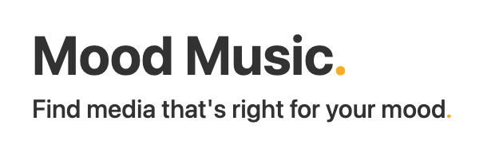

 
 

## **Development Team**

* Nick Reeder, development lead, Spotify Web API
* John Edmondson, development lead, user interface and styling
* Ahmed Ghouzlane, development lead, TasteDive API
* Jonathan Stull, development lead, Spotify keyword analysis

## **Description**

Mood Media is a playlist recommendation engine built with Spotify's Web API and TasteDive. It queries a user's mood with a range of emotions from negative to positive and returns a matching Spotify playlist alongside further book and movie recommendations provided by TasteDive. With Mood Music, you can find media that's right for your mood.

This team project was created during Week VII at [Epicodus](https://www.epicodus.com/), a coding bootcamp in Portland, Oregon.

## **Setup/Installation Requirements**

* Software requirements (internet browser, code editor, etc.)
  1. Internet browser
  2. A code editor like VSCode or Atom to view or edit the codebase

* Download/clone instructions
  1. Download this repository onto your computer by clicking the 'code' button
  2. Open the project folder
  3. Double-click the index.html to open it in your web browser

* Open via Bash/GitBash:
  1. Clone this repository onto your computer: `git clone origin` with the correct URL for [Mood Music.](https://github.com/reeder32/mood-music)
  2. Navigate into the `~/mood-music`  directory and open in VSCode or preferred text editor with `code .`
  3. Run `npm install` to install dependencies; open a webpack server with the command `npm run start`

* API Instructions for Spotify
  1. Visit [Spotify for Developers](https://developer.spotify.com/)
  2. Create a developer account, navigate to the Dashboard, and create a new account to obtain a CLIENT ID and CLIENT SECRET
  3. Store the CLIENT ID and CLIENT SECRET in your .env using the variable names `CLIENT_ID` and `CLIENT_SECRET`

* API Instructions for TasteDive
  1. Visit the developer portal at [TasteDive](https://tastedive.com/read/api)
  2. Under ACCESS, click [request an access key](https://tastedive.com/account/api_access) and sign up for an account
  3. If prompted, complete your application profile and save
  4. Save the API access key to your .env
  * Note: API calls to TasteDive will prompt an "Access-Control-Allow-Origin" error that cannot be addressed with a fetch parameter `mode: 'no-cors'`. It can be easily resolved with a Heroku proxy server as described in [this Stack Overflow answer](https://stackoverflow.com/questions/43262121/trying-to-use-fetch-and-pass-in-mode-no-cors)

## **Known Bugs**

* None

## **Specs**

Version 1.0 (29 April 2021)
* Build a web app that allows a user to input their current mood by selecting from a list of preset mood keywords
* Compare the user input to a Spotify keyword that corresponds with known playlist query results
* Query Spotify's Web API with the Spotify keyword
* Render a random playlist from a range of 10 maximum search results
* Return the random playlist to the DOM
* Compare the user input to a title "seed" to generate a TasteDive query title
* Query TasteDive's API to return a list of book and movie recommendations and render that list to the DOM
* Style elements to correspond with each input mood

## **Technologies Used**

* HTML/CSS
* JavaScript
* jQuery
* Markdown
* VS Code
* webpack 4.39.3
* Google Chrome/Mozilla Firefox
* Spotify Web API (oAuth)
* TasteDive API
* Google Sheets (for building keyword arrays; [see Spotify Keywords](https://docs.google.com/spreadsheets/d/1-0cxhn0fTvNkI6AzHPGx80i8n16V_Ge4EK5W29SDhv0/edit?usp=sharing))

## **MIT License**

Copyright (c) 2021 Mood Music.

Permission is hereby granted, free of charge, to any person obtaining a copy of this software and associated documentation files (the "Software"), to deal in the Software without restriction, including without limitation the rights to use, copy, modify, merge, publish, distribute, sublicense, and/or sell copies of the Software, and to permit persons to whom the Software is furnished to do so, subject to the following conditions:

The above copyright notice and this permission notice shall be included in all copies or substantial portions of the Software.

THE SOFTWARE IS PROVIDED "AS IS", WITHOUT WARRANTY OF ANY KIND, EXPRESS OR IMPLIED, INCLUDING BUT NOT LIMITED TO THE WARRANTIES OF MERCHANTABILITY, FITNESS FOR A PARTICULAR PURPOSE AND NONINFRINGEMENT. IN NO EVENT SHALL THE AUTHORS OR COPYRIGHT HOLDERS BE LIABLE FOR ANY CLAIM, DAMAGES OR OTHER LIABILITY, WHETHER IN AN ACTION OF CONTRACT, TORT OR OTHERWISE, ARISING FROM,
OUT OF OR IN CONNECTION WITH THE SOFTWARE OR THE USE OR OTHER DEALINGS IN THE SOFTWARE.

## **Contact Information**

If you are interested in more work like this, please refer to the GitHub profiles for the team members listed below:

* [Nick Reeder](https://github.com/reeder32)
* [John Edmonson](https://github.com/basicjohn)
* [Jonathan Stull](https://github.com/jonathanstull)
* [Ahmed Ghouzlane](https://github.com/aGhouzlane)